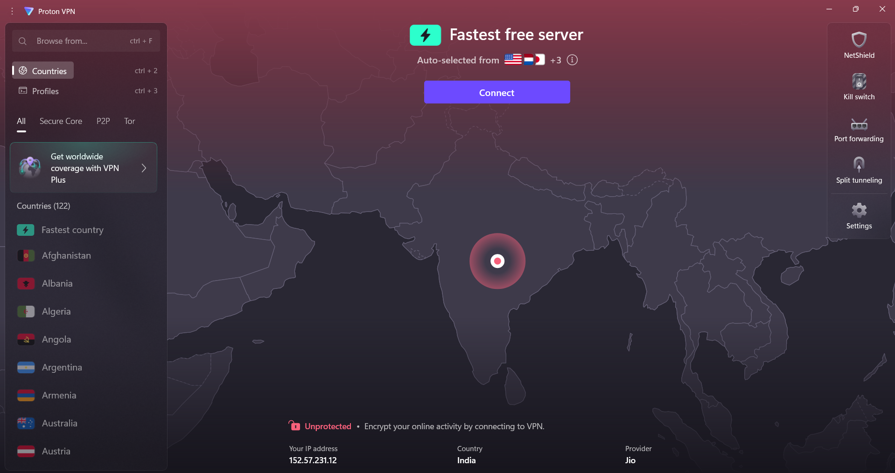
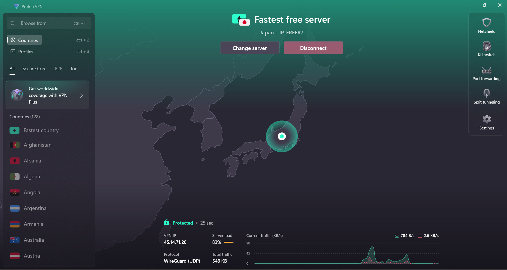
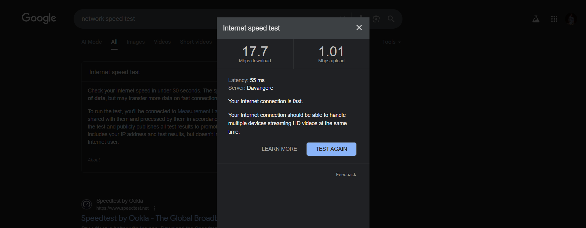
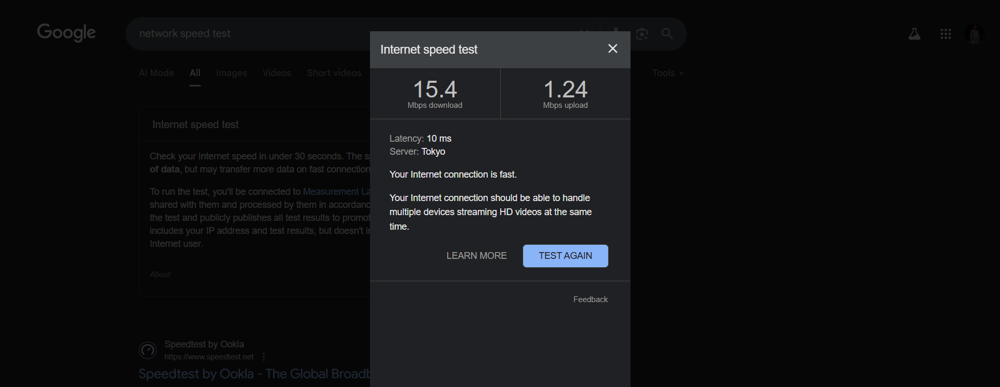
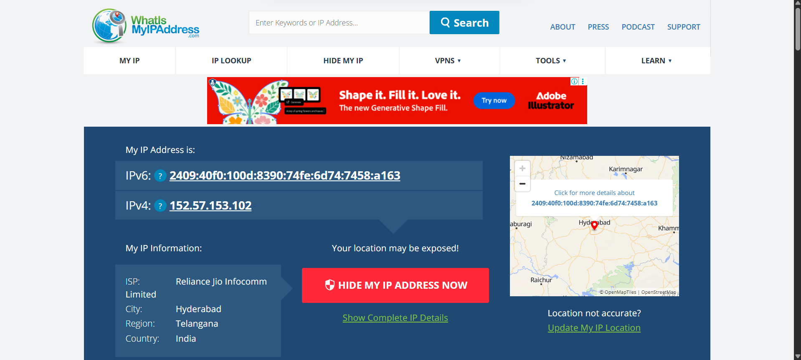
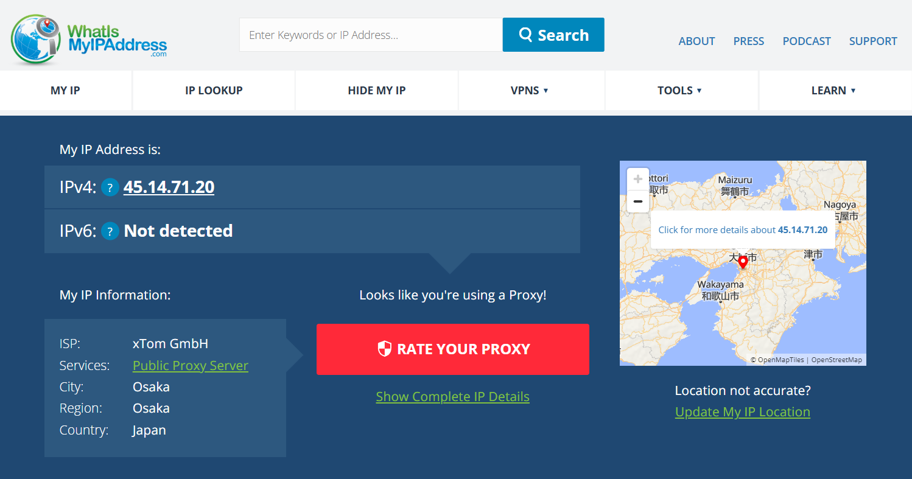

# 🛡️ VPN Privacy & Security Report - Task 8

## 🎯 Objective
Understand the role of VPNs in protecting privacy and securing communication by setting up a free VPN client, verifying its operation, and analyzing its impact on network speed and IP address.

---

## 🛠️ VPN Setup Steps

1. **Choose a reputable free VPN:**  
   Selected **ProtonVPN** for its unlimited free tier and strong security.

2. **Sign up:**  
   Created a ProtonVPN account through their official website.

3. **Download and install:**  
   Installed the ProtonVPN client for **Windows**.

4. **Connect to a VPN server:**  
   Connected to the fastest free server (Japan).

5. **Verify IP address change:**  
   Checked IP on *whatismyipaddress.com* → confirmed new IP and location.

6. **Browse and test encryption:**  
   Browsed sites and ran speed tests to ensure traffic is encrypted.

7. **Disconnect and compare:**  
   Disconnected VPN and compared changes in IP and speed.

8. **Research VPN features:**  
   Studied ProtonVPN’s encryption and privacy features.

---

## 📸 Before vs After: Screenshots & Results

### 🔗 Connection Status

| State         | Screenshot   | Description |
|---------------|-------------|-------------|
| **Before VPN** |  | Not connected – original IP/location exposed. |
| **After VPN**  |    | Connected to **Japan server**, VPN active and masking IP. |

---

### 🚀 Network Speed Test

| State         | Screenshot   | Download (Mbps) | Upload (Mbps) | Latency | Server Location |
|---------------|-------------|-----------------|---------------|---------|----------------|
| **Before VPN** |  | 17.7 | 1.01 | 55 ms | Davangere (India) |
| **After VPN**  |   | 15.4 | 1.24 | 10 ms | Tokyo (Japan) |

**Observation:**  
The VPN connection slightly reduced **download speed** (from 17.7 → 15.4 Mbps) but slightly improved **upload speed** (1.01 → 1.24 Mbps). Latency improved when connected to the Tokyo server. Overall, minimal performance impact.

---

### 🌍 IP Address Change

- **Before VPN:**  
  - IPv4: `152.57.153.102`  
  - ISP: Reliance Jio  
  - Location: Hyderabad, India  

  

- **After VPN:**  
  - IPv4: `45.14.71.20`  
  - ISP: xTom GmbH (VPN provider)  
  - Location: Osaka, Japan  

  

✅ Result: IP address and geolocation successfully changed, proving VPN is masking the real identity.

---

## 🔒 VPN Encryption & Privacy Features

- **Encryption:** AES-256 via WireGuard (UDP) — strong encryption for secure tunneling.  
- **No-logs policy:** ProtonVPN does not store user activity logs.  
- **Kill switch:** Prevents data leaks if VPN disconnects.  
- **DNS leak protection:** Ensures DNS queries also pass through VPN tunnel.

---

## ✅ Benefits & ⚠️ Limitations of VPN

### ✅ Benefits
- Encrypts all traffic — secures browsing even on public Wi-Fi.  
- Hides IP and location — improves privacy.  
- Allows access to geo-blocked content.  
- Protects against ISP monitoring.  

### ⚠️ Limitations
- Free servers are limited (few locations).  
- Speed may drop depending on server load/distance.  
- Not complete anonymity (browser cookies/fingerprinting still track).  
- Some services detect/block VPN connections.  

---

## 🏁 Conclusion
Using **ProtonVPN** successfully demonstrated how VPNs:  
- Encrypt online traffic,  
- Mask the real IP (India → Japan),  
- Provide privacy on insecure networks.  

Performance impact was minimal — speeds remained usable even after connecting to a Japan server. VPNs are highly effective for privacy but are not a silver bullet for all online tracking.  

---
